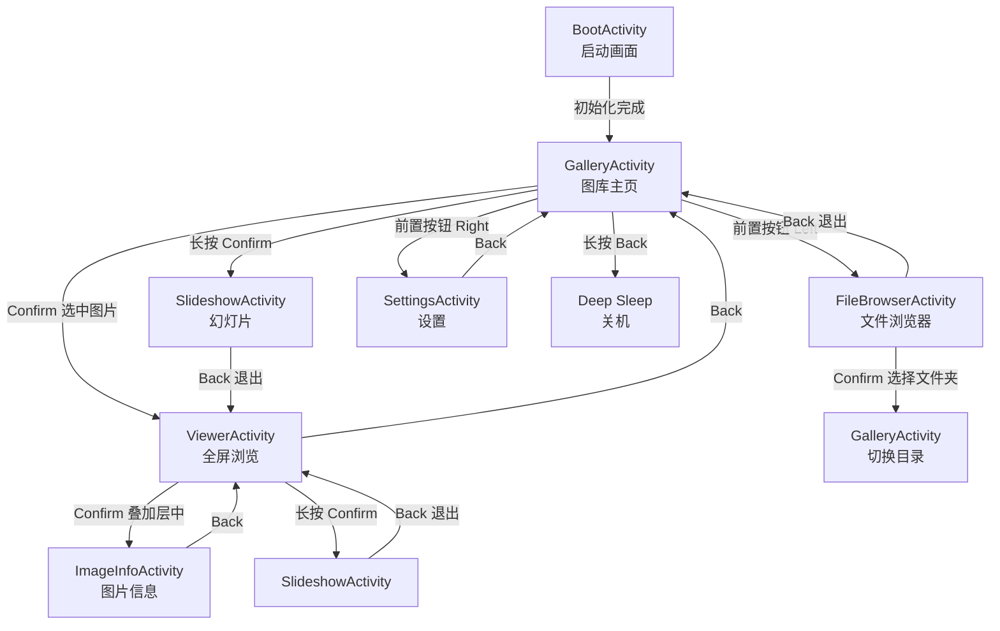

# Y-X4-Album 固件架构设计

**版本**: v1.0  
**日期**: 2026-04-04  
**状态**: 初稿

---

## 目录

1. [架构总览](#1-架构总览)
2. [模块划分](#2-模块划分)
3. [Activity 导航图](#3-activity-导航图)
4. [图片处理管线](#4-图片处理管线)
5. [内存预算](#5-内存预算)
6. [缩略图缓存设计](#6-缩略图缓存设计)
7. [图片解码策略](#7-图片解码策略)
8. [灰度渲染方案](#8-灰度渲染方案)
9. [与 crosspoint-reader 的集成](#9-与-crosspoint-reader-的集成)
10. [类图与接口定义](#10-类图与接口定义)
11. [设置系统设计](#11-设置系统设计)
12. [E-Ink 刷新策略](#12-e-ink-刷新策略)

---

## 1. 架构总览

### 1.1 分层架构

```
┌──────────────────────────────────────────────────────┐
│                   Application Layer                   │
│  BootActivity │ GalleryActivity │ ViewerActivity │... │
├──────────────────────────────────────────────────────┤
│                    Album Core Layer                   │
│  ImageScanner │ ImageDecoder │ ThumbnailCache │ ...  │
├──────────────────────────────────────────────────────┤
│                   Framework Layer                     │
│  ActivityManager │ GfxRenderer │ MappedInputManager   │
│  AlbumSettings   │ AlbumTheme  │ I18n                │
├──────────────────────────────────────────────────────┤
│                      HAL Layer                        │
│  HalDisplay │ HalGPIO │ HalStorage │ HalPowerManager │
├──────────────────────────────────────────────────────┤
│                   Hardware / SDK                      │
│  EInkDisplay │ InputManager │ SDCardManager │ Battery │
└──────────────────────────────────────────────────────┘
```

### 1.2 设计原则

- **内存第一**：380KB RAM 是硬上限，所有设计决策以内存安全为最高优先级
- **流式处理**：图片解码采用逐行/逐块回调，从不在 RAM 中持有完整图片
- **单缓冲**：仅一个 48KB framebuffer，灰度渲染时临时备份/恢复
- **缓存到 SD 卡**：缩略图、设置、状态等均持久化到 TF 卡，减少 RAM 占用
- **复用优先**：最大程度复用 crosspoint-reader 的成熟组件

### 1.3 线程模型

```
主线程 (Arduino loop)
  ├── ActivityManager.loop()
  │     ├── mappedInput.update()     // 按钮轮询
  │     ├── currentActivity->loop()  // 业务逻辑
  │     └── 检查 pending activity 切换
  │
渲染线程 (FreeRTOS Task, 优先级 1)
  ├── 等待 requestUpdate 信号
  ├── RenderLock 获取互斥锁
  ├── currentActivity->render()      // 绘制到 framebuffer
  └── displayBuffer()                // 触发 E-Ink 刷新

缩略图生成任务 (可选, FreeRTOS Task, 优先级 0)
  ├── 从队列取下一张待生成的图片路径
  ├── 解码 + 缩放 + 1-bit 抖动
  └── 写入 SD 卡缓存文件
```

> **注意**：缩略图生成任务仅在 GalleryActivity 活跃时创建，在 onExit() 中销毁。
> 此任务与渲染线程不共享 framebuffer，仅使用自己的临时缓冲区。

---

## 2. 模块划分

### 2.1 模块依赖图

```
                    ┌─────────────┐
                    │    main.cpp  │
                    └──────┬──────┘
                           │
              ┌────────────┼────────────┐
              ▼            ▼            ▼
     ┌──────────────┐ ┌────────┐ ┌───────────────┐
     │ActivityManager│ │AlbumApp│ │AlbumSettings  │
     └───────┬──��───┘ └───┬────┘ └───────┬───────┘
             │            │              │
    ┌────────┼────────────┼──────────────┤
    ▼        ▼            ▼              ▼
┌────────┐ ���──────┐ ┌──────────┐ ┌──────────────┐
│Activity│ │Image │ │Thumbnail │ │  AlbumState   │
│ (各页面)│ │Scanner│ │  Cache   │ │ (浏览位置记忆) │
└───┬────┘ └──┬───┘ └────┬─────┘ └──────────────┘
    │         │          │
    ▼         ▼          ▼
┌────────┐ ┌──────────┐ ┌─────────────┐
│GfxRend-│ │ImageDeco-│ │  HalStorage │
│erer    │ │der       │ │             │
└────────┘ └──────────┘ └─────────────┘
```

### 2.2 模块职责表

| 模块 | 目录 | 职责 | 关键依赖 |
|------|------|------|----------|
| **AlbumApp** | `src/` | 全局初始化协调、硬件启动序列、电源按钮处理 | 所有模块 |
| **Activity 页面** | `src/activities/` | 7 个 UI 页面的生命周期和渲染 | ActivityManager, GfxRenderer |
| **ImageScanner** | `src/album/` | 扫描目录、构建文件索引、排序 | HalStorage |
| **ImageDecoder** | `src/album/` | JPEG/PNG/BMP 解码，全屏渲染和缩略图生成 | JPEGDEC, PNGdec, Bitmap |
| **ThumbnailCache** | `src/album/` | 缩略图缓存管理（生成、查找、失效、清除） | ImageDecoder, HalStorage |
| **AlbumSettings** | `src/settings/` | 设置读写、二进制序列化、CRC 校验 | HalStorage |
| **AlbumState** | `src/settings/` | 浏览位置记忆（目录、图片索引、页码） | HalStorage |
| **AlbumTheme** | `src/components/` | UI 主题（状态栏、按钮提示、网格、弹窗等组件） | GfxRenderer, BaseTheme |
| **ActivityManager** | (复用) | Activity 栈管理、渲染线程调度 | GfxRenderer |
| **GfxRenderer** | (复用) | 绘图原语、灰度支持、方向控制 | HalDisplay |
| **MappedInputManager** | (复用) | 按钮逻辑映射 | HalGPIO |

### 2.3 源码目录结构

```
src/
├── main.cpp                        # 入口：硬件初始化、全局对象、setup()/loop()
├── AlbumApp.h / .cpp               # 应用全局协调（启动流程、电源管理、sleep）
│
├── activities/                     # UI 页面（Activity 子类）
│   ├── BootActivity.h / .cpp       # 启动画面 + 图片扫描
│   ├── GalleryActivity.h / .cpp    # 图库网格视图（5×3 缩略图）
│   ├── ViewerActivity.h / .cpp     # 全屏图片浏览（灰度渲染）
│   ├── SlideshowActivity.h / .cpp  # 幻灯片自动播放
│   ├── FileBrowserActivity.h / .cpp# 目录浏览器
│   ├── SettingsActivity.h / .cpp   # 设置页面
│   └── ImageInfoActivity.h / .cpp  # 图片信息页
│
├── album/                          # 相册核心逻辑
│   ├── ImageScanner.h / .cpp       # 图片扫描和索引
│   ├── ImageDecoder.h / .cpp       # 图片解码（JPEG/PNG/BMP 统一接口）
│   ├── ImageIndex.h / .cpp         # 文件列表管理（排序、分页、查找）
│   └── ThumbnailCache.h / .cpp     # 缩略图缓存系统
│
├── settings/                       # 设置和状态
│   ├── AlbumSettings.h / .cpp      # 设置管理（二进制序列化 + CRC）
│   └── AlbumState.h / .cpp         # 浏览位置记忆
│
├── components/                     # UI 组件和主题
│   ├── AlbumTheme.h / .cpp         # 主题：状态栏、按钮提示、弹窗、网格
│   ├── StatusBar.h / .cpp          # 状态栏组件
│   └── icons/                      # 图标资源（文件夹、图片、设置等）
│
└── fontIds.h                       # 字体 ID 常量
```

---

## 3. Activity 导航图

### 3.1 页面列表

| Activity | 名称 | 说明 |
|----------|------|------|
| `BootActivity` | 启动画面 | Logo + 初始化进度 + 图片扫描 |
| `GalleryActivity` | 图库（主页） | 5×3 缩略图网格，核心浏览界面 |
| `ViewerActivity` | 全屏浏览 | 单张图片灰度渲染，信息叠加层 |
| `SlideshowActivity` | 幻灯片 | 自动轮播，电子相框模式 |
| `FileBrowserActivity` | 文件浏览器 | 目录导航，选择图库来源文件夹 |
| `SettingsActivity` | 设置 | 设置列表 + 选择弹窗 |
| `ImageInfoActivity` | 图片信息 | 文件元数据显示 |

### 3.2 导航流转图



### 3.3 Activity 生命周期

每个 Activity 遵循 crosspoint-reader 的生命周期模式：

```
            ┌────────────┐
            │  onEnter() │ ← 分配资源、初始化状态
            └──────┬─────┘
                   │
            ┌──────▼──────┐
        ┌──→│   loop()    │ ← 处理输入、更新逻辑
        │   └──────┬──────┘
        │          │ requestUpdate()
        │   ┌──────▼──────┐
        │   │  render()   │ ← 绘制到 framebuffer（渲染线程）
        │   └──────┬──────┘
        │          │
        └──────────┘ (循环)
                   │ finish() / replaceActivity()
            ┌──────▼─────┐
            │  onExit()  │ ← 释放资源、停止任务
            └────────────┘
```

### 3.4 Activity 切换机制

| 方法 | 语义 | 使用场景 |
|------|------|----------|
| `replaceActivity()` | 清空栈，替换当前 Activity | Boot → Gallery, 文件夹切换 |
| `pushActivity()` | 当前 Activity 压栈，启动新 Activity | Gallery → Viewer, Viewer → Info |
| `popActivity()` | 销毁当前，恢复栈顶 Activity | Info → Viewer, Viewer → Gallery |
| `startActivityForResult()` | push + 回调返回结果 | Settings 选择弹窗 |

---

## 4. 图片处理管线

### 4.1 完整数据流

```
┌──────────┐    ┌──────────┐    ┌──────────────┐    ┌──────────┐    ┌──────────┐
│  TF 卡   │───→│ 格式检测 │───→│  解码器选择   │───→│ 流式解码 │───→│ 灰度转换 │
│ 图片文件 │    │ (扩展名) │    │ JPEG/PNG/BMP │    │ (逐行/块) │    │ RGB→Luma │
└──────────┘    └──────────┘    └──────────────┘    └──────────┘    └─────┬────┘
                                                                          │
┌──────────┐    ┌──────────┐    ┌──────────────┐    ┌──────────┐         │
│ E-Ink    │←───│ 帧缓冲   │←───│  抖动处理    │←───│ 缩放映射 │←────────┘
│ 刷新     │    │ 写入     │    │ Atkinson/FS  │    │ 坐标变换 │
└──────────┘    └──────────┘    └──────────────┘    └──────────┘
```

### 4.2 全屏图片渲染流程（详细）

```cpp
// 伪代码：ViewerActivity 渲染一张图片
void ViewerActivity::renderImage(const char* path) {
    // 1. 检测格式
    ImageFormat fmt = ImageDecoder::detectFormat(path);

    // 2. 备份 BW 帧缓冲（用于灰度渲染）
    bool isGrayscale = (settings.renderMode == RenderMode::Grayscale);
    if (isGrayscale) {
        renderer.storeBwBuffer();   // 分配 48KB 备份
    }

    // 3. 计算目标区域（居中、Fit/Fill 模式）
    ImageInfo info = ImageDecoder::getImageInfo(path);
    Rect destRect = calculateDestRect(info.width, info.height,
                                       renderer.getScreenWidth(),
                                       renderer.getScreenHeight(),
                                       settings.scaleMode);

    // 4. 清屏
    renderer.clearScreen(settings.bgWhite ? 0xFF : 0x00);

    // 5. 解码并渲染到帧缓冲
    if (isGrayscale) {
        ImageDecoder::decodeGrayscale(path, renderer, destRect);
        // 内部: 逐行解码 → RGB→灰度 → Atkinson 抖动 → 写 LSB/MSB
        renderer.displayGrayBuffer();
        renderer.restoreBwBuffer();  // 释放 48KB 备份
    } else {
        ImageDecoder::decodeBW(path, renderer, destRect);
        // 内部: 逐行解码 → RGB→灰度 → 1-bit 抖动 → 写 framebuffer
        renderer.displayBuffer(HalDisplay::FULL_REFRESH);
    }
}
```

### 4.3 缩略图生成流程

```
原始图片 ──→ 解码器（降采样模式）──→ 缩放到 140×120 ──→ 1-bit Atkinson 抖动 ──→ BMP 文件写入 SD 卡
                                          │
                                    仅需 ~4KB 行缓冲
                                    + ~2KB 抖动状态
```

### 4.4 格式分发表

| 格式 | 解码库 | 降采样支持 | 流式处理方式 | 内存峰值 |
|------|--------|-----------|-------------|---------|
| **JPEG** | JPEGDEC (bitbank2) | 1/2, 1/4, 1/8 | MCU 块回调 (8×8/16×16) | ~22KB |
| **PNG** | PNGdec (bitbank2) | 无 | 逐行回调 | ~40KB |
| **BMP** | Bitmap (复用) | 无 | 逐行读取 readNextRow() | ~4KB |

---

## 5. 内存预算

### 5.1 总览

| 类别 | 分配 | 说明 |
|------|------|------|
| **系统/运行时** | ~100KB | FreeRTOS 内核、任务栈、Arduino 运行时、驱动 |
| **帧缓冲** | 48KB | 单缓冲 800×480÷8，由 EInkDisplay 管理 |
| **应用基础** | ~30KB | Activity 栈、设置、状态、字体指针、全局对象 |
| **功能工作区** | 动态 | 根据当前功能按需分配/释放（见下） |
| **安全余量** | ≥50KB | `ESP.getFreeHeap()` 不低于 50KB |
| **总计** | ≤330KB | 380KB - 50KB 安全余量 |

### 5.2 各功能场景内存峰值

#### 场景 A：图库页面（Gallery）

| 分配项 | 大小 | 生命周期 |
|--------|------|----------|
| 文件索引 (ImageIndex) | ≤32KB | GalleryActivity 生存期 |
| 当前页缩略图 BMP 读取缓冲 | ~4KB | 每张缩略图渲染时临时 |
| 缩略图生成任务栈 | 4KB | 后台任务运行时 |
| 缩略图生成工作区 | ≤24KB | 生成单张缩略图时 |
| **峰值合计** | ~64KB | |
| **剩余可用** | ~138KB | ✅ 超过 50KB 安全线 |

#### 场景 B：全屏浏览（JPEG 灰度）

| 分配项 | 大小 | 生命周期 |
|--------|------|----------|
| BW 缓冲备份 (storeBwBuffer) | 48KB | 灰度渲染期间 |
| JPEGDEC 内部状态 | ~22KB | 解码期间 |
| MCU 行像素缓冲 (RGB) | ~5KB | 解码期间 |
| Atkinson 抖动状态 | ~5KB | 解码期间 |
| **峰值合计** | ~80KB | |
| **剩余可用** | ~122KB | ✅ 超过 50KB 安全线 |

#### 场景 C：全屏浏览（PNG 灰度）

| 分配项 | 大小 | 生命周期 |
|--------|------|----------|
| BW 缓冲备份 | 48KB | 灰度渲染期间 |
| PNGdec 内部状态 + inflate | ~40KB | 解码期间 |
| Atkinson 抖动状态 | ~5KB | 解码期间 |
| **峰值合计** | ~93KB | |
| **剩余可用** | ~109KB | ✅ 超过 50KB 安全线 |

#### 场景 D：幻灯片模式

与场景 B/C 相同（逐张解码渲染），无额外分配。CPU 在图片间隔期间降频至 10MHz。

#### 场景 E：设置页面

| 分配项 | 大小 | 生命周期 |
|--------|------|----------|
| 设置列表状态 | <1KB | SettingsActivity 生存期 |
| 弹窗渲染 | 0 (复用 framebuffer) | 渲染时 |
| **峰值合计** | <1KB | |
| **剩余可用** | ~200KB+ | ✅ |

### 5.3 内存安全规则

1. **互斥使用**：图库的文件索引在进入 Viewer 时释放；Viewer 退出后重建
2. **RAII 释放**：所有 Activity 的 `onExit()` 必须释放 `onEnter()` 中分配的资源
3. **分配失败处理**：`malloc` 返回 nullptr 时降级（如：跳过缩略图生成，显示占位图）
4. **堆碎片监控**：关键操作前后打印 `ESP.getFreeHeap()` 和 `ESP.getMaxAllocHeap()`
5. **大缓冲区用 malloc**：超过 256 字节的缓冲区使用 `malloc`，不放栈上

---

## 6. 缩略图缓存设计

### 6.1 SD 卡目录结构

```
TF 卡根目录/
├── .y-x4-album/                    # 应用数据目录（隐藏）
│   ├── thumbs/                     # 缩略图缓存
│   │   ├── a1b2c3d4e5f6.bmp       # 缓存文件（hash 命名）
│   │   ├── f7e8d9c0b1a2.bmp
│   │   └── ...
│   ├── settings.bin                # 设置文件
│   └── state.bin                   # 浏览状态（上次位置）
├── DCIM/
│   ├── photo_001.jpg
│   └── ...
└── ...
```

### 6.2 缓存键生成

缓存键 = 对以下字符串计算 FNV-1a 32-bit 哈希：

```
"{文件绝对路径}:{文件大小}:{修改时间戳}"
```

转为 8 字符十六进制作为文件名：`a1b2c3d4.bmp`

选择 FNV-1a 的理由：
- 计算极快（无需加密强度），适合 MCU
- 32-bit 足够（同一目录不太可能碰撞）
- 实现仅需 ~20 行代码，无外部依赖

### 6.3 缩略图规格

| 参数 | 值 | 说明 |
|------|-----|------|
| 尺寸 | 140×120 px | 匹配 UX 设计中的网格单元大小 |
| 色深 | 1-bit (单色) | 最小化文件大小和渲染开销 |
| 格式 | BMP (top-down) | 无需解码，直接 drawBitmap1Bit() |
| 文件大小 | ~2.4KB/张 | (140×120÷8) + 62字节头 ≈ 2162 字节 |
| 抖动算法 | Atkinson 1-bit | 复用 BitmapHelpers 中的 Atkinson1BitDitherer |

### 6.4 缓存生命周期

```
1. 进入 GalleryActivity
   ├── 扫描当前目录，构建 ImageIndex
   ├── 对当前页每张图片：
   │   ├── 计算缓存键 hash
   │   ├── 检查 .y-x4-album/thumbs/{hash}.bmp 是否存在
   │   ├── 存在 → 直接加载渲染
   │   └── 不存在 → 显示占位图，加入后台生成队列
   │
   └── 后台缩略图生成任务（FreeRTOS task, 优先级 0）
       ├── 从队列取下一个待生成项
       ├── 打开源图片文件
       ├── JPEG: JPEGDEC 降采样解码 → 1-bit Atkinson → 写 BMP
       ├── PNG: PNGdec 扫描线回调 → 缩放 → 1-bit Atkinson → 写 BMP
       ├── BMP: Bitmap 逐行读取 → 缩放 → 1-bit Atkinson → 写 BMP
       ├── 通知 GalleryActivity 刷新对应位置
       └── 循环处理队列

2. 翻页时
   ├── 清空当前生成队列（旧页未完成的取消）
   └── 为新页面排队（优先当前可视页）

3. 清除缓存（设置中触发）
   └── 删除 .y-x4-album/thumbs/ 下所有 .bmp 文件
```

### 6.5 缓存失效策略

- **自动失效**：缓存键包含文件大小和修改时间，文件被替换时自动失效
- **孤儿清理**：不主动清理孤儿缓存文件（避免全盘扫描的开销）
- **手动清除**：设置页面提供"清除缩略图缓存"操作
- **空间预估**：1000 张图片 ≈ 2.4MB 缓存空间，对 TF 卡可忽略

---

## 7. 图片解码策略

### 7.1 JPEG 解码（JPEGDEC 库）

JPEGDEC (bitbank2) 是为嵌入式系统设计的 JPEG 解码库，核心优势是 **MCU 块级回调**和**内置降采样**。

#### 降采样策略

```
原始分辨率          降采样因子     解码后尺寸          适用条件
≤ 800×480          1 (无)         原尺寸              直接适配屏幕
≤ 1600×960         1/2            ≤800×480            2MP 以下
≤ 3200×1920        1/4            ≤800×480            6MP 以下
≤ 6400×3840        1/8            ≤800×480            8MP 以下
> 6400×3840        1/8            >800×480            需要额外软件缩放
```

自动选择最小降采样因子，使解码后尺寸 ≥ 屏幕尺寸（保证质量）：

```cpp
int ImageDecoder::calcJpegScale(int imgW, int imgH, int screenW, int screenH) {
    // 返回 JPEGDEC 的 scale 值: 0=full, 1=1/2, 2=1/4, 3=1/8
    for (int scale = 0; scale <= 3; scale++) {
        int div = 1 << scale;
        if (imgW / div <= screenW * 2 && imgH / div <= screenH * 2) {
            return scale;
        }
    }
    return 3; // 最大降采样
}
```

#### MCU 回调处理

```cpp
// JPEGDEC 对每个 MCU 块调用此回调
int jpegDrawCallback(JPEGDRAW* pDraw) {
    // pDraw->x, pDraw->y: MCU 在图片中的位置（已考虑降采样）
    // pDraw->pPixels: RGB565 像素数据
    // pDraw->iWidth, pDraw->iHeight: MCU 块尺寸

    for (int row = 0; row < pDraw->iHeight; row++) {
        int srcY = pDraw->y + row;
        // 坐标映射到屏幕目标区域
        int destY = mapToScreen(srcY, ...);
        if (destY < 0 || destY >= screenH) continue;

        for (int col = 0; col < pDraw->iWidth; col++) {
            int srcX = pDraw->x + col;
            int destX = mapToScreen(srcX, ...);
            if (destX < 0 || destX >= screenW) continue;

            // RGB565 → 灰度
            uint16_t rgb565 = pDraw->pPixels[row * pDraw->iWidth + col];
            uint8_t gray = rgb565ToGray(rgb565);

            // 写入帧缓冲（BW 或灰度模式）
            writePixelToFramebuffer(destX, destY, gray);
        }
    }
    return 1; // 继续解码
}
```

#### 内存使用

| 分配项 | 大小 | 说明 |
|--------|------|------|
| JPEGDEC 对象 | ~22KB | 库内部 Huffman 表 + 工作区 |
| 文件读取缓冲 | 4KB | 通过回调从 SD 卡读取 |
| MCU 像素缓冲 | 由库管理 | 包含在 22KB 内 |

### 7.2 PNG 解码（PNGdec 库）

PNGdec (bitbank2) 支持逐行回调解码，内部管理 inflate 解压状态。

#### 解码流程

```cpp
bool ImageDecoder::decodePng(const char* path, GfxRenderer& renderer, Rect destRect) {
    PNG png;
    HalFile file;
    Storage.openFileForRead("PNG", path, file);

    // 打开并解析头部
    png.open(file, pngDrawCallback);

    // 获取尺寸
    int imgW = png.getWidth();
    int imgH = png.getHeight();

    // 设置用户数据（传递目标区域等信息）
    PngDecodeContext ctx = { &renderer, destRect, imgW, imgH };
    png.setUserPointer(&ctx);

    // 解码（PNGdec 逐行调用 pngDrawCallback）
    png.decode(nullptr, 0);  // 0 = 无额外选项
    png.close();
}

// PNGdec 对每行调用此回调
void pngDrawCallback(PNGDRAW* pDraw) {
    PngDecodeContext* ctx = (PngDecodeContext*)pDraw->pUser;
    // pDraw->y: 当前行号
    // pDraw->pPixels: RGBA 像素数据 (width × 4 bytes)
    // 处理逻辑同 JPEG 回调（缩放映射 + 灰度转换 + 抖动）
}
```

#### PNG 特殊约束

- **最大扫描线宽度**：2048 px（由 `PNG_MAX_BUFFERED_PIXELS=16416` 限制）
- **无内置降采样**：宽度 > 2048 的 PNG 无法解码，跳过并显示错误
- **Alpha 通道**：透明像素映射为白色背景

#### 内存使用

| 分配项 | 大小 | 说明 |
|--------|------|------|
| PNGdec 对象 + inflate 状态 | ~40KB | 库内部管理 |
| 行像素缓冲 | 由库管理 | 包含在上述 40KB 内 |

### 7.3 BMP 直接渲染

BMP 文件使用 crosspoint-reader 的 `Bitmap` 类逐行读取：

```cpp
bool ImageDecoder::decodeBmp(const char* path, GfxRenderer& renderer, Rect destRect) {
    HalFile file;
    Storage.openFileForRead("BMP", path, file);

    Bitmap bmp(file, /* dithering= */ true);
    if (bmp.parseHeaders() != BmpReaderError::Ok) return false;

    // 分配行缓冲（单行像素数据）
    uint8_t* rowBuf = (uint8_t*)malloc(bmp.getRowBytes());
    if (!rowBuf) return false;

    // 逐行读取并绘制
    renderer.drawBitmap(bmp, destRect.x, destRect.y, destRect.width, destRect.height);

    free(rowBuf);
    file.close();
    return true;
}
```

#### 内存使用

| 分配项 | 大小 | 说明 |
|--------|------|------|
| Bitmap 对象 | <1KB | 头部解析 + 状态 |
| 行缓冲 | ≤3KB | 800×3 字节 (24-bit 最大行) |
| 抖动状态 | ~4KB | 如果启用 Atkinson/FS |

### 7.4 缩放算法

对于全屏渲染，解码后图片尺寸可能与屏幕不完全匹配，需要软件缩放。

采用**最近邻缩放**（在解码回调中实时计算）：

```cpp
// 在解码回调中，对每个源像素计算目标位置
int destX = srcX * destRect.width / decodedWidth + destRect.x;
int destY = srcY * destRect.height / decodedHeight + destRect.y;
```

选择最近邻而非双线性的理由：
1. E-Ink 4 级灰度下，双线性插值的质量优势不明显
2. 最近邻零额外内存开销，无需行缓冲
3. JPEGDEC 的降采样已经提供了高质量的初始缩放

---

## 8. 灰度渲染方案

### 8.1 GfxRenderer 灰度机制

GfxRenderer 支持 4 级灰度（2-bit），通过两个位平面（LSB + MSB）实现：

| 灰度级别 | LSB | MSB | 视觉效果 |
|----------|-----|-----|----------|
| 0 (黑) | 0 | 0 | 全黑 |
| 1 (深灰) | 1 | 0 | 深灰 |
| 2 (浅灰) | 0 | 1 | 浅灰 |
| 3 (白) | 1 | 1 | 全白 |

### 8.2 图片灰度渲染步骤

```
1. renderer.storeBwBuffer()          // 备份 BW 帧缓冲 → 分配 48KB
   │
2. renderer.clearScreen(0xFF)        // 清屏为白色
   │
3. renderer.setRenderMode(GRAYSCALE_LSB)
   │  解码图片，对每个像素：
   │  ├── RGB → 灰度值 (0-255)
   │  ├── Atkinson 抖动 → 量化为 0/1/2/3
   │  └── 取 LSB 位 → drawPixel(x, y, bit0)
   │
4. renderer.copyGrayscaleLsbBuffers()  // 发送 LSB 到显示驱动
   │
5. renderer.clearScreen(0xFF)
   │
6. renderer.setRenderMode(GRAYSCALE_MSB)
   │  再次解码同一图片，对每个像素：
   │  ├── 相同的 RGB → 灰度 → Atkinson 抖动 → 量化
   │  └── 取 MSB 位 → drawPixel(x, y, bit1)
   │
7. renderer.copyGrayscaleMsbBuffers()  // 发送 MSB 到显示驱动
   │
8. renderer.displayGrayBuffer()        // 4 级灰度波形刷新
   │
9. renderer.restoreBwBuffer()          // 恢复 BW 帧缓冲 → 释放 48KB
```

> **重要**：灰度渲染需要**解码图片两次**（LSB 和 MSB 各一次）。
> 由于图片从 SD 卡流式读取（不缓存在 RAM），两次解码是不可避免的。
> 好处是内存峰值不变（不需要保存中间灰度数据）。

### 8.3 优化：避免双重解码

为减少 SD 卡读取次数，可采用**逐行双平面写入**的优化策略：

在解码回调中，对每个像素同时计算 LSB 和 MSB，分别写入两个逻辑位平面。
具体实现：先渲染 LSB 平面 → `copyGrayscaleLsbBuffers()` → 再渲染 MSB 平面 → `copyGrayscaleMsbBuffers()`。

但由于 framebuffer 只有一个（48KB），两个平面只能串行写入，因此仍需两次解码。

**替代方案**：如果未来内存允许，可以分配第二个 48KB 缓冲区同时持有两个平面，实现单次解码。但当前 380KB 下不可行。

### 8.4 抖动算法选择

| 算法 | 质量 | 速度 | 内存 | 用途 |
|------|------|------|------|------|
| **Atkinson** | ★★★★ | ★★★★ | ~5KB | 全屏图片渲染（默认） |
| **Floyd-Steinberg** | ★★★★★ | ★★★ | ~4KB | 备选（蛇形扫描减少条纹） |
| **Bayer 4×4** | ★★★ | ★★★★★ | 0 | GfxRenderer 内置，用于 UI 灰度填充 |
| **Atkinson 1-bit** | ★★★★ | ★★★★ | ~5KB | 缩略图生成 |

默认使用 Atkinson 抖动（与 crosspoint-reader 一致），因为：
- 仅扩散 75% 误差，结果比 Floyd-Steinberg 更干净
- 已针对 X4 E-Ink 面板校准了量化阈值
- 复用 `BitmapHelpers.h` 中的现有实现

### 8.5 BW 模式渲染

BW（纯黑白）模式更简单：

```
1. 解码图片，对每个像素：
   ├── RGB → 灰度
   └── Atkinson 1-bit 抖动 → 0 或 1
   └── drawPixel(x, y, state)
2. renderer.displayBuffer(FULL_REFRESH)
```

无需 storeBwBuffer/restoreBwBuffer，无需双次解码。

---

## 9. 与 crosspoint-reader 的集成

### 9.1 复用模块清单

| 模块 | 路径 | 复用方式 | 说明 |
|------|------|----------|------|
| **open-x4-sdk** | `open-x4-sdk/` | symlink 依赖 | EInkDisplay, InputManager, BatteryMonitor, SDCardManager |
| **HAL 层** | `lib/hal/` | lib_extra_dirs | HalDisplay, HalGPIO, HalStorage, HalPowerManager, HalSystem |
| **GfxRenderer** | `lib/GfxRenderer/` | lib_extra_dirs | 绘图、文字、位图、灰度 |
| **Bitmap** | `lib/GfxRenderer/` | lib_extra_dirs | BMP 解析和行级读取 |
| **BitmapHelpers** | `lib/GfxRenderer/` | lib_extra_dirs | 抖动算法（Atkinson, Floyd-Steinberg） |
| **PngToBmpConverter** | `lib/PngToBmpConverter/` | lib_extra_dirs | 缩略图 PNG→BMP 转换 |
| **JpegToBmpConverter** | `lib/JpegToBmpConverter/` | lib_extra_dirs | 缩略图 JPEG→BMP 转换 |
| **EpdFont** | `lib/EpdFont/` | lib_extra_dirs | 字体渲染 |
| **Logging** | `lib/Logging/` | lib_extra_dirs | LOG_INF, LOG_DBG, LOG_ERR |
| **I18n** | `lib/I18n/` | lib_extra_dirs | 多语言支持 |
| **FsHelpers** | `lib/FsHelpers/` | lib_extra_dirs | 文件系统辅助函数 |

### 9.2 需要适配的模块

| 模块 | 原始 | 适配内容 |
|------|------|----------|
| **ActivityManager** | crosspoint-reader 的源码 | 复制到本项目 `src/`，移除 goToReader/goToBrowser 等阅读器专用方法，替换为相册导航方法 |
| **Activity 基类** | crosspoint-reader 的源码 | 复制到本项目 `src/activities/`，移除 onGoHome/onSelectBook 等阅读器专用方法 |
| **ActivityResult** | crosspoint-reader 的源码 | 复制并简化，仅保留相册需要的 Result 类型 |
| **MappedInputManager** | crosspoint-reader 的源码 | 复制到本项目 `src/`，功能不变 |
| **RenderLock** | crosspoint-reader 的源码 | 原样复制 |
| **UITheme / BaseTheme** | crosspoint-reader 的源码 | 复制并大幅简化，仅保留相册需要的 UI 组件 |

### 9.3 本项目独有模块

| 模块 | 说明 |
|------|------|
| **ImageScanner** | 目录扫描、格式过滤、自然排序 |
| **ImageDecoder** | 统一的图片解码接口（封装 JPEGDEC/PNGdec/Bitmap） |
| **ImageIndex** | 文件列表管理（排序、分页、循环导航） |
| **ThumbnailCache** | 缩略图缓存（FNV-1a 哈希、生成队列、SD 卡读写） |
| **AlbumSettings** | 二进制设置文件（CRC 校验、版本迁移） |
| **AlbumState** | 浏览位置记忆（目录路径、图片索引） |
| **AlbumTheme** | 相册 UI 主题（状态栏、网格布局、弹窗） |
| **所有 Activity** | 7 个全新的 Activity 实现 |

### 9.4 集成方式（platformio.ini）

```ini
; 通过 symlink 引用 open-x4-sdk 硬件驱动
lib_deps =
  BatteryMonitor=symlink://../../../lib/crosspoint-reader/open-x4-sdk/libs/hardware/BatteryMonitor
  InputManager=symlink://../../../lib/crosspoint-reader/open-x4-sdk/libs/hardware/InputManager
  EInkDisplay=symlink://../../../lib/crosspoint-reader/open-x4-sdk/libs/display/EInkDisplay
  SDCardManager=symlink://../../../lib/crosspoint-reader/open-x4-sdk/libs/hardware/SDCardManager
  bitbank2/PNGdec @ ^1.0.0
  bitbank2/JPEGDEC @ ^1.8.0

; 通过 lib_extra_dirs 引用 HAL、渲染器、工具库
lib_extra_dirs =
  ../../../lib/crosspoint-reader/lib
```

> **关键原则**：HAL 层和渲染库通过 lib_extra_dirs 直接共享源码（不复制），
> 确保上游 bug 修复自动生效。
> Activity/Manager/Settings 等业务逻辑代码复制到本项目，独立演进。

---

## 10. 类图与接口定义

### 10.1 核心类头文件设计

#### Activity 基类（适配版）

```cpp
// src/activities/Activity.h
#pragma once
#include <GfxRenderer.h>
#include <Logging.h>
#include <memory>
#include <string>
#include <utility>
#include "ActivityManager.h"
#include "RenderLock.h"

class Activity {
    friend class ActivityManager;
protected:
    std::string name;
    GfxRenderer& renderer;
    MappedInputManager& mappedInput;
public:
    explicit Activity(std::string name, GfxRenderer& renderer, MappedInputManager& mappedInput)
        : name(std::move(name)), renderer(renderer), mappedInput(mappedInput) {}
    virtual ~Activity() = default;
    virtual void onEnter();
    virtual void onExit();
    virtual void loop() {}
    virtual void render(RenderLock&&) {}
    virtual void requestUpdate(bool immediate = false);
    virtual void requestUpdateAndWait();
    virtual bool skipLoopDelay() { return false; }
    virtual bool preventAutoSleep() { return false; }

    void startActivityForResult(std::unique_ptr<Activity>&& activity,
                                std::function<void(bool cancelled)> handler);
    void finish();
};
```

#### ImageScanner

```cpp
// src/album/ImageScanner.h
#pragma once
#include <HalStorage.h>
#include <cstdint>

enum class ImageFormat : uint8_t { JPEG, PNG, BMP, Unknown };

struct ImageEntry {
    char filename[128];   // 文件名（不含路径）
    uint32_t fileSize;    // 文件大小（字节）
    uint32_t modTime;     // 修改时间戳
    ImageFormat format;   // 图片格式
};

class ImageScanner {
public:
    // 扫描目录下的图片文件，填充 entries 数组
    // 返回找到的图片数量，最多 maxEntries ���
    static int scanDirectory(const char* dirPath, ImageEntry* entries, int maxEntries);

    // 检测文件格式（基于扩展名）
    static ImageFormat detectFormat(const char* filename);

    // 判断文件名是否为支持的图片格式
    static bool isSupportedImage(const char* filename);
};
```

#### ImageIndex

```cpp
// src/album/ImageIndex.h
#pragma once
#include "ImageScanner.h"
#include <cstdint>

enum class SortMode : uint8_t {
    NameAsc, NameDesc, TimeNewest, TimeOldest, SizeLargest
};

class ImageIndex {
public:
    ImageIndex() = default;
    ~ImageIndex();

    // 从 ImageScanner 结果构建索引
    bool build(const char* dirPath, int maxEntries = 500);
    void clear();

    // 排序
    void sort(SortMode mode);

    // 访问
    int count() const { return count_; }
    const ImageEntry& at(int index) const;

    // 分页（每页 pageSize 张）
    int pageCount(int pageSize) const;
    int pageOf(int index, int pageSize) const;

    // 路径构建（目录路径 + 文件名 → 完整路径）
    void getFullPath(int index, char* outPath, int maxLen) const;

    // 查找（按文件名）
    int findByFilename(const char* filename) const;

private:
    char dirPath_[256] = {};
    ImageEntry* entries_ = nullptr;  // malloc 分配
    int count_ = 0;
    int capacity_ = 0;
};
```

#### ImageDecoder

```cpp
// src/album/ImageDecoder.h
#pragma once
#include <GfxRenderer.h>
#include <cstdint>

struct Rect;

enum class ScaleMode : uint8_t { Fit, Fill, Stretch };

struct ImageInfo {
    int width;
    int height;
    ImageFormat format;
    uint32_t fileSize;
};

class ImageDecoder {
public:
    // 获取图片信息（仅读取头部，不解码）
    static bool getImageInfo(const char* path, ImageInfo& info);

    // 全屏灰度渲染（4 级灰度，需要两次解码）
    static bool decodeGrayscale(const char* path, GfxRenderer& renderer,
                                 int screenW, int screenH,
                                 ScaleMode mode, bool bgWhite);

    // 全屏 BW 渲染（单色，一次解码）
    static bool decodeBW(const char* path, GfxRenderer& renderer,
                          int screenW, int screenH,
                          ScaleMode mode, bool bgWhite);

    // 生成缩略图（1-bit BMP，写入 SD 卡）
    static bool generateThumbnail(const char* srcPath, const char* dstPath,
                                   int maxWidth, int maxHeight);

private:
    // JPEG 解码内部实现
    static bool decodeJpeg(const char* path, GfxRenderer& renderer,
                            int screenW, int screenH, ScaleMode mode,
                            bool grayscaleLsb);
    // PNG 解码内部实现
    static bool decodePng(const char* path, GfxRenderer& renderer,
                           int screenW, int screenH, ScaleMode mode,
                           bool grayscaleLsb);
    // BMP 解码内部实现
    static bool decodeBmp(const char* path, GfxRenderer& renderer,
                           int screenW, int screenH, ScaleMode mode);

    // 计算 JPEG 降采样因子
    static int calcJpegScale(int imgW, int imgH, int targetW, int targetH);

    // 计算目标绘制区域
    static Rect calcDestRect(int imgW, int imgH, int screenW, int screenH,
                              ScaleMode mode);
};
```

#### ThumbnailCache

```cpp
// src/album/ThumbnailCache.h
#pragma once
#include <HalStorage.h>
#include <cstdint>

class ThumbnailCache {
public:
    static constexpr int THUMB_WIDTH = 140;
    static constexpr int THUMB_HEIGHT = 120;
    static constexpr const char* CACHE_DIR = "/.y-x4-album/thumbs";

    // 初始化缓存目录（确保目录存在）
    static bool init();

    // 检查缩略图是否已缓存
    static bool exists(const char* imagePath, uint32_t fileSize, uint32_t modTime);

    // 获取缓存文件路径
    static void getCachePath(const char* imagePath, uint32_t fileSize, uint32_t modTime,
                              char* outPath, int maxLen);

    // 生成缩略图并写入缓存
    static bool generate(const char* imagePath, uint32_t fileSize, uint32_t modTime);

    // 清除所有缓存
    static bool clearAll();

    // 获取缓存统计
    static int getCachedCount();

private:
    // FNV-1a 32-bit 哈希
    static uint32_t fnv1aHash(const char* str);
};
```

#### AlbumSettings

```cpp
// src/settings/AlbumSettings.h
#pragma once
#include <cstdint>

// 设置结构体（二进制布局，固定大小）
#pragma pack(push, 1)
struct AlbumSettingsData {
    uint8_t version;            // 设置文件版本号

    // 显示设置
    uint8_t orientation;        // 0=横屏, 1=竖屏, 2=横屏倒置, 3=竖屏倒置
    uint8_t renderMode;         // 0=灰度, 1=BW
    uint8_t scaleMode;          // 0=Fit, 1=Fill, 2=Stretch
    uint8_t bgWhite;            // 0=黑色背景, 1=白色背景
    uint8_t fullRefreshInterval;// 每 N 张完全刷新（1/5/10/15/30）
    uint8_t showStatusBar;      // 0=隐藏, 1=显示

    // 浏览设置
    uint8_t sortMode;           // SortMode 枚举值
    uint8_t loopBrowsing;       // 0=不循环, 1=循环
    uint8_t galleryColumns;     // 网格列数（3/4/5）

    // 幻灯片设置
    uint16_t slideshowInterval; // 播放间隔（秒）
    uint8_t slideshowOrder;     // 0=顺序, 1=随机, 2=随机不重复
    uint8_t slideshowLoop;      // 0=不循环, 1=循环
    uint8_t slideshowScope;     // 0=当前文件夹, 1=含子目录, 2=全部

    // 系统设置
    uint16_t autoSleepMinutes;  // 自动休眠分钟数（0=从不）
    uint8_t sleepDisplay;       // 0=最后一张图, 1=空白, 2=自定义
    uint8_t language;           // 语言代码索引

    // 按钮设置
    uint8_t sideButtonReversed; // 0=正常, 1=反转

    // 相册根目录
    char rootDir[128];          // 默认浏览根目录路径

    // CRC 校验
    uint32_t crc32;
};
#pragma pack(pop)

static_assert(sizeof(AlbumSettingsData) < 256, "Settings struct too large");

class AlbumSettings {
public:
    static constexpr const char* SETTINGS_PATH = "/.y-x4-album/settings.bin";

    AlbumSettingsData data;

    // 加载设置（从 SD 卡读取，失败则使用默认值）
    bool loadFromFile();

    // 保存设置到 SD 卡
    bool saveToFile();

    // 重置为默认值
    void resetToDefaults();

    // 单例访问
    static AlbumSettings& getInstance() { return instance; }

private:
    static AlbumSettings instance;
    static uint32_t calculateCrc(const AlbumSettingsData& data);
};

#define SETTINGS AlbumSettings::getInstance()
```

#### AlbumState

```cpp
// src/settings/AlbumState.h
#pragma once
#include <cstdint>

#pragma pack(push, 1)
struct AlbumStateData {
    uint8_t version;
    char lastDir[256];          // 上次浏览的目录
    char lastImage[128];        // 上次浏览的图片文件名
    uint16_t lastGalleryPage;   // 图库页码
    uint8_t lastGalleryIndex;   // 网格内焦点位置
    uint32_t crc32;
};
#pragma pack(pop)

class AlbumState {
public:
    static constexpr const char* STATE_PATH = "/.y-x4-album/state.bin";

    AlbumStateData data;

    bool loadFromFile();
    bool saveToFile();
    void clear();

    static AlbumState& getInstance() { return instance; }

private:
    static AlbumState instance;
    static uint32_t calculateCrc(const AlbumStateData& data);
};

#define APP_STATE AlbumState::getInstance()
```

#### GalleryActivity

```cpp
// src/activities/GalleryActivity.h
#pragma once
#include "Activity.h"
#include "album/ImageIndex.h"
#include "album/ThumbnailCache.h"
#include <freertos/FreeRTOS.h>
#include <freertos/task.h>
#include <freertos/queue.h>

class GalleryActivity final : public Activity {
public:
    explicit GalleryActivity(GfxRenderer& renderer, MappedInputManager& mappedInput)
        : Activity("Gallery", renderer, mappedInput) {}

    void onEnter() override;
    void onExit() override;
    void loop() override;
    void render(RenderLock&&) override;

private:
    ImageIndex imageIndex;
    int focusIndex = 0;         // 网格内焦点位置（0 ~ pageSize-1）
    int currentPage = 0;        // 当前页码
    bool needsRedraw = true;

    // 缩略图后台生成
    TaskHandle_t thumbTaskHandle = nullptr;
    QueueHandle_t thumbQueue = nullptr;
    static void thumbGenTask(void* param);
    void startThumbGenTask();
    void stopThumbGenTask();
    void queueVisibleThumbnails();

    // 导航
    void moveFocus(int dx, int dy);
    void nextPage();
    void prevPage();
    void openSelectedImage();
    void openFileBrowser();
    void openSettings();
    void startSlideshow();

    // 渲染
    void drawThumbnailGrid(const RenderLock& lock);
    void drawStatusBar();
    void drawButtonHints();
    void drawThumbnailAt(int gridX, int gridY, int imageIndex);
    void drawFocusHighlight(int gridX, int gridY);

    // 布局计算
    int getPageSize() const;   // 行数 × 列数
    int getColumns() const;
    int getRows() const;
};
```

#### ViewerActivity

```cpp
// src/activities/ViewerActivity.h
#pragma once
#include "Activity.h"
#include "album/ImageIndex.h"

class ViewerActivity final : public Activity {
public:
    ViewerActivity(GfxRenderer& renderer, MappedInputManager& mappedInput,
                   ImageIndex& imageIndex, int startIndex)
        : Activity("Viewer", renderer, mappedInput),
          imageIndex(imageIndex), currentIndex(startIndex) {}

    void onEnter() override;
    void onExit() override;
    void loop() override;
    void render(RenderLock&&) override;
    bool preventAutoSleep() override { return false; }

private:
    ImageIndex& imageIndex;
    int currentIndex;
    bool overlayVisible = false;
    unsigned long overlayShowTime = 0;
    int partialRefreshCount = 0;   // 快刷计数器

    void showNextImage();
    void showPrevImage();
    void toggleOverlay();
    void openImageInfo();
    void startSlideshow();
    void renderImage();
    bool shouldFullRefresh();
};
```

#### SlideshowActivity

```cpp
// src/activities/SlideshowActivity.h
#pragma once
#include "Activity.h"
#include "album/ImageIndex.h"

class SlideshowActivity final : public Activity {
public:
    SlideshowActivity(GfxRenderer& renderer, MappedInputManager& mappedInput,
                      ImageIndex& imageIndex, int startIndex)
        : Activity("Slideshow", renderer, mappedInput),
          imageIndex(imageIndex), currentIndex(startIndex) {}

    void onEnter() override;
    void onExit() override;
    void loop() override;
    void render(RenderLock&&) override;
    bool preventAutoSleep() override { return true; }

private:
    ImageIndex& imageIndex;
    int currentIndex;
    bool paused = false;
    unsigned long lastSwitchTime = 0;

    void advanceImage();
    void renderCurrentImage();
    void togglePause();
};
```

---

## 11. 设置系统设计

### 11.1 设置项完整列表

| 分类 | 设置项 | 键 | 类型 | 默认值 | 选项 |
|------|--------|-----|------|--------|------|
| **显示** | 屏幕方向 | orientation | enum | 0 (横屏) | 0/1/2/3 |
| | 渲染模式 | renderMode | enum | 0 (灰度) | 0=灰度, 1=BW |
| | 缩放模式 | scaleMode | enum | 0 (Fit) | 0=Fit, 1=Fill, 2=Stretch |
| | 背景颜色 | bgWhite | bool | 1 (白) | 0=黑, 1=白 |
| | 完全刷新频率 | fullRefreshInterval | u8 | 5 | 1/5/10/15/30 |
| | 状态栏 | showStatusBar | bool | 1 | 0/1 |
| **浏览** | 排序方式 | sortMode | enum | 0 | 0~4 |
| | 循环浏览 | loopBrowsing | bool | 1 | 0/1 |
| | 图库列数 | galleryColumns | u8 | 5 | 3/4/5 |
| **幻灯片** | 播放间隔 | slideshowInterval | u16 | 30 | 5~3600 秒 |
| | 播放顺序 | slideshowOrder | enum | 0 | 0=顺序, 1=随机, 2=随机不重复 |
| | 循环播放 | slideshowLoop | bool | 1 | 0/1 |
| | 播放范围 | slideshowScope | enum | 0 | 0/1/2 |
| **系统** | 自动休眠 | autoSleepMinutes | u16 | 10 | 0/1/5/10/15/30 |
| | 休眠画面 | sleepDisplay | enum | 0 | 0=最后一张, 1=空白, 2=自定义 |
| | 语言 | language | u8 | 0 | 语言索引 |
| **按钮** | 侧按钮方向 | sideButtonReversed | bool | 0 | 0/1 |
| **路径** | 相册根目录 | rootDir | char[128] | "/" | 目录路径 |

### 11.2 持久化方案

```
┌──────────────────────────────────────┐
│         settings.bin 文件结构         │
├──────────────────────────────────────┤
│ [版本号 1B] [设置数据 ~150B] [CRC 4B] │
└──────────────────────────────────────┘
```

- **存储格式**：`AlbumSettingsData` 结构体直接二进制写入
- **CRC 校验**：CRC-32，覆盖版本号和设置数据
- **保存时机**：每次设置变更后立即写入（先写临时文件再 rename）
- **加载失败**：CRC 不匹配或文件不存在 → 使用默认值
- **版本迁移**：`version` 字段允许未来扩展字段，新版本加载旧格式时补充默认值

---

## 12. E-Ink 刷新策略

### 12.1 刷新模式

| 模式 | HalDisplay 常量 | 耗时 | 用途 |
|------|-----------------|------|------|
| **全刷新** | `FULL_REFRESH` | ~1.7s | 页面切换、图片灰度渲染、清除残影 |
| **半刷新** | `HALF_REFRESH` | ~1.7s | 保留，较少使用 |
| **快刷新** | `FAST_REFRESH` | <500ms | 焦点移动、列表滚动、UI 更新 |
| **灰度刷新** | `displayGrayBuffer()` | ~1s | 灰度图片显示 |

### 12.2 各场景刷新策略

| 场景 | 刷新模式 | 说明 |
|------|----------|------|
| 启动画面 → 图库 | 全刷新 | 干净的初始画面 |
| 图库焦点移动（同页） | 快刷新 | 仅更新选中框位置 |
| 图库翻页 | 全刷新 | 15 张缩略图整页更新 |
| 图库 → 全屏浏览 | 灰度刷新 | 图片需要最佳画质 |
| 全屏浏览切换图片 | 灰度刷新 | 图片间切换 |
| 全屏浏览每 N 张 | 全刷新 | 清除累积残影 |
| 信息叠加层显示/隐藏 | 快刷新 | UI 元素仅黑白 |
| 幻灯片自动切换 | 灰度刷新 | 减少视觉干扰 |
| 文件浏览器焦点移动 | 快刷新 | 纯文字列表 |
| 设置页面焦点移动 | 快刷新 | 纯文字列表 |
| 设置弹窗显示/关闭 | 快刷新 | UI 弹窗 |
| 屏幕方向更改 | 全刷新 | 整屏重绘 |
| 任何 Activity 切换 | 全刷新 | 清除可能的残影 |

### 12.3 残影管理

- 维护 `partialRefreshCount` 计数器
- 每 `settings.fullRefreshInterval` 次快刷后执行一次全刷新
- Activity 间切换始终全刷新
- 灰度 → BW 切换时执行 `cleanupGrayscaleWithFrameBuffer()` 清除灰度残留

---

## 附录

### A. 关键尺寸常量

```cpp
// 屏幕
constexpr int SCREEN_WIDTH_LANDSCAPE = 800;
constexpr int SCREEN_HEIGHT_LANDSCAPE = 480;
constexpr int FRAMEBUFFER_SIZE = 800 * 480 / 8;  // 48,000 bytes

// 网格布局（横屏 5×3）
constexpr int GALLERY_COLS_DEFAULT = 5;
constexpr int GALLERY_ROWS_LANDSCAPE = 3;
constexpr int THUMB_WIDTH = 140;
constexpr int THUMB_HEIGHT = 120;
constexpr int THUMB_H_SPACING = 16;
constexpr int THUMB_V_SPACING = 11;
constexpr int PAGE_SIZE_LANDSCAPE = 15;  // 5 × 3

// 状态栏和按钮提示
constexpr int STATUS_BAR_HEIGHT = 24;
constexpr int BUTTON_HINTS_HEIGHT = 40;
constexpr int CONTENT_HEIGHT_LANDSCAPE = 480 - 24 - 40;  // 416px

// 可视边距（E-Ink 面板物理边距）
constexpr int VIEWABLE_MARGIN_TOP = 9;
constexpr int VIEWABLE_MARGIN_RIGHT = 3;
constexpr int VIEWABLE_MARGIN_BOTTOM = 3;
constexpr int VIEWABLE_MARGIN_LEFT = 3;

// 图片约束
constexpr int IMAGE_MIN_SIZE = 16;
constexpr int IMAGE_MAX_SAFE = 4096;
constexpr int IMAGE_HARD_LIMIT = 8192;

// 文件索引
constexpr int MAX_FILES_PER_DIR = 500;
```

### B. 构建配置

```ini
; C++20, 无异常, 无 RTTI
build_flags =
  -std=gnu++2a
  -fno-exceptions
  -DEINK_DISPLAY_SINGLE_BUFFER_MODE=1
  -DPNG_MAX_BUFFERED_PIXELS=16416
```

### C. 日志约定

```cpp
// 使用 Logging.h 提供的宏
LOG_INF("MODULE", "Info message: %d", value);
LOG_DBG("MODULE", "Debug message: %s", str);
LOG_ERR("MODULE", "Error: failed to %s", operation);

// 模块标签
// MAIN, BOOT, GALLERY, VIEWER, SLIDESHOW, BROWSER, SETTINGS
// SCANNER, DECODER, THUMB, CACHE, STATE
```
