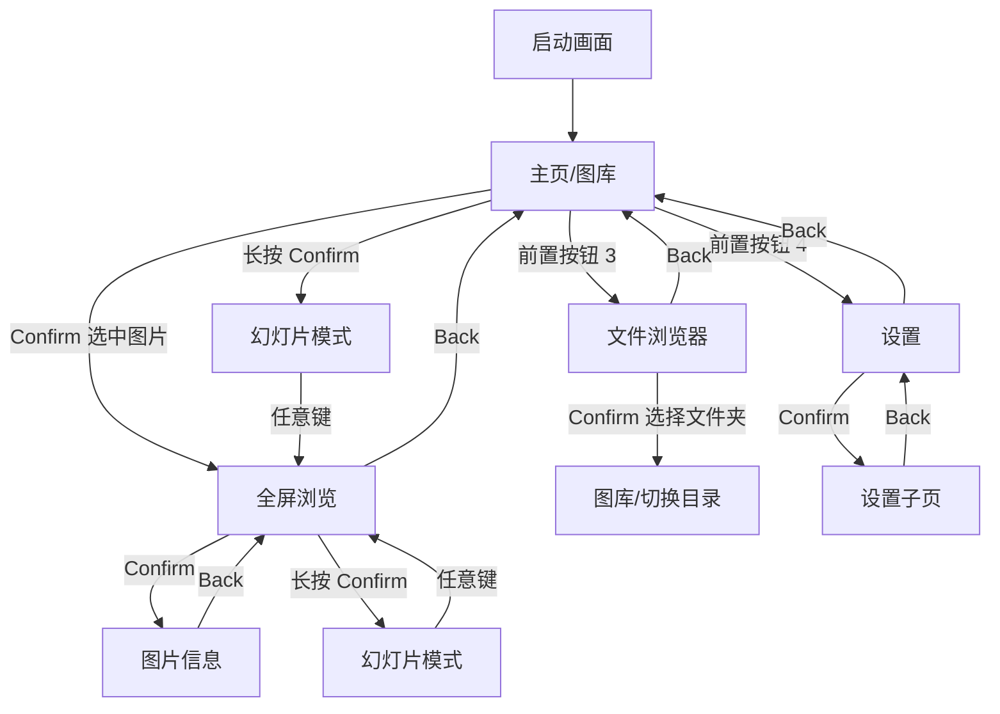

# Y-X4-Album UX 交互设计方案

> 版本：1.0  
> 日期：2026-04-04  
> 设备：Xteink X4 E-Ink 电子相册

---

## 目录

1. [设计原则](#1-设计原则)
2. [信息架构](#2-信息架构)
3. [状态栏设计](#3-状态栏设计)
4. [界面详细设计](#4-界面详细设计)
   - 4.1 [启动画面（Boot Screen）](#41-启动画面boot-screen)
   - 4.2 [主页/图库（Gallery）](#42-主页图库gallery)
   - 4.3 [全屏图片浏览（Viewer）](#43-全屏图片浏览viewer)
   - 4.4 [幻灯片模式（Slideshow）](#44-幻灯片模式slideshow)
   - 4.5 [文件浏览器（File Browser）](#45-文件浏览器file-browser)
   - 4.6 [设置页面（Settings）](#46-设置页面settings)
   - 4.7 [图片信息页（Image Info）](#47-图片信息页image-info)
   - 4.8 [空状态与错误状态](#48-空状态与错误状态)
5. [按钮操作总映射表](#5-按钮操作总映射表)
6. [E-Ink 刷新策略](#6-e-ink-刷新策略)
7. [过渡和反馈设计](#7-过渡和反馈设计)
8. [图库网格布局计算](#8-图库网格布局计算)

---

## 1. 设计原则

### E-Ink 特性适配
- **高对比度优先**：黑白为主，灰度仅用于图片渲染和图标，UI 元素保持纯黑白
- **减少刷新**：合并操作、减少页面切换，每次操作尽量在一次刷新内完成
- **清晰反馈**：因 E-Ink 刷新慢（1-2秒），用户需要明确知道"操作已接受"

### 按钮交互原则
- **一致性**：同类按钮在所有界面保持相同语义（如 Back 始终返回上一级）
- **可发现性**：底部始终显示按钮功能提示
- **容错性**：误操作可回退，无不可逆操作（删除需确认）

### 内存约束设计
- 缩略图按需加载，可见区域外立即释放
- 图片浏览采用单张模式，不预加载相邻图片
- 所有弹窗/对话框复用同一渲染区域

---

## 2. 信息架构

### 页面层级

```
电源开机
  │
  ▼
启动画面 (Boot Screen)
  │
  ▼
┌─────────────────────────────────────────────────┐
│              主页/图库 (Gallery)                   │
│         ← 默认入口，缩略图网格视图 →                │
└────┬──────────┬──────────┬──────────┬───────────┘
     │          │          │          │
     ▼          ▼          ▼          ▼
 全屏浏览    文件浏览器    设置页面    幻灯片模式
 (Viewer)  (File Browser) (Settings) (Slideshow)
     │                     │
     ▼                     ▼
 图片信息              各设置子页
 (Image Info)      (Sub-Settings)
```

### 导航流转图（Mermaid）



---

## 3. 状态栏设计

状态栏位于屏幕顶部，高度 24px，在所有界面（除全屏浏览和幻灯片）中显示。

### 横屏布局（800×480）

```
┌────────────────────────────────────────────────────────────────────────────────────┐
│ 📁 当前文件夹名            3/126 张                              10:30  ██▌ 85% │
│ ← 左对齐                  ← 居中                                     ← 右对齐 → │
└────────────────────────────────────────────────────────────────────────────────────┘
  24px 高度
```

### 状态栏元素

| 位置 | 内容 | 说明 |
|------|------|------|
| 左侧 | 文件夹图标 + 当前目录名 | 截断显示，最大 200px 宽 |
| 中间 | 图片计数 `N/M 张` | 当前索引 / 总数 |
| 右侧 | 时间 + 电池图标 + 百分比 | 电池图标 16×12px |

### 竖屏布局（480×800）

状态栏相同结构，但宽度缩减到 480px，文件夹名最大 120px。

---

## 4. 界面详细设计

---

### 4.1 启动画面（Boot Screen）

**目的**：品牌展示 + 初始化等待（TF 卡挂载、图片扫描）

**线框图**：
```
┌────────────────────────────────────────────────────────────────────────────────────┐
│                                                                                    │
│                                                                                    │
│                                                                                    │
│                                                                                    │
│                              ┌──────────────────┐                                  │
│                              │                  │                                  │
│                              │   X4  ALBUM      │                                  │
│                              │   ──────────     │                                  │
│                              │   电 子 相 册    │                                  │
│                              │                  │                                  │
│                              └──────────────────┘                                  │
│                                                                                    │
│                                                                                    │
│                            正在扫描图片...  56%                                     │
│                         ┌━━━━━━━━━━━━━━━░░░░░░░░┐                                  │
│                         └──────────────────────-┘                                  │
│                                                                                    │
│                                                                                    │
│                              v1.0.0  Xteink                                        │
│                                                                                    │
└────────────────────────────────────────────────────────────────────────────────────┘
800 × 480
```

**布局细节**：
- Logo 区域：屏幕中心偏上，约 (300, 140) 起始，200×120px
- 产品名称：大号字体，居中，Y=200
- 进度条：(200, 320)，宽 400px，高 16px
- 进度文字：进度条上方 24px，居中
- 版本号：底部居中，Y=440

**状态流转**：
1. 显示 Logo + "正在初始化..."
2. TF 卡挂载成功 → "正在扫描图片..." + 进度条
3. 扫描完成 → 自动跳转到图库
4. TF 卡挂载失败 → 显示错误状态（见 4.8）

**按钮映射**：
| 按钮 | 功能 |
|------|------|
| 所有按钮 | 无响应（初始化期间不接受输入） |

---

### 4.2 主页/图库（Gallery）

**目的**：以缩略图网格展示当前文件夹中的所有图片，核心浏览界面

**线框图（横屏 800×480）**：
```
┌────────────────────────────────────────────────────────────────────────────────────┐
│ 📁 我的照片                 3/126 张                             10:30  ██▌ 85% │  24px 状态栏
├────────────────────────────────────────────────────────────────────────────────────┤
│                                                                                    │
│  ┌─────────┐  ┌─────────┐  ┌─────────┐  ┌─────────┐  ┌─────────┐                 │
│  │         │  │         │  │         │  │         │  │         │                 │
│  │  IMG_1  │  │  IMG_2  │  │ [IMG_3] │  │  IMG_4  │  │  IMG_5  │                 │
│  │         │  │  ████   │  │ ▓▓████▓ │  │  ████   │  │  ████   │                 │
│  │  ████   │  │  ████   │  │ ▓████▓▓ │  │  ████   │  │  ████   │                 │
│  └─────────┘  └─────────┘  └━━━━━━━━━┘  └─────────┘  └─────────┘                 │
│                              ↑ 选中项                                              │
│  ┌─────────┐  ┌─────────┐  ┌─────────┐  ┌─────────┐  ┌─────────┐                 │
│  │         │  │         │  │         │  │         │  │         │                 │
│  │  IMG_6  │  │  IMG_7  │  │  IMG_8  │  │  IMG_9  │  │  IMG_10 │                 │
│  │         │  │         │  │         │  │         │  │         │                 │
│  │  ████   │  │  ████   │  │  ████   │  │  ████   │  │  ████   │                 │
│  └─────────┘  └─────────┘  └─────────┘  └─────────┘  └─────────┘                 │
│                                                                                    │
│  ┌─────────┐  ┌─────────┐  ┌─────────┐  ┌─────────┐  ┌─────────┐                 │
│  │         │  │         │  │         │  │         │  │         │                 │
│  │  IMG_11 │  │  IMG_12 │  │  IMG_13 │  │  IMG_14 │  │  IMG_15 │                 │
│  │  ████   │  │  ████   │  │  ████   │  │  ████   │  │  ████   │                 │
│  │         │  │         │  │         │  │         │  │         │                 │
│  └─────────┘  └─────────┘  └─────────┘  └─────────┘  └─────────┘                 │
│                                                                                    │
├────────────────────────────────────────────────────────────────────────────────────┤
│  [打开]         [幻灯片]        [文件夹]        [设置]                              │  40px 按钮提示
└────────────────────────────────────────────────────────────────────────────────────┘
```

**布局细节**（详见第 8 节网格计算）：
- 状态栏：24px
- 网格区域：800×416px（480 - 24 状态栏 - 40 按钮提示）
- 网格：5 列 × 3 行 = 15 张缩略图/页
- 缩略图尺寸：140×120px（含 2px 边框）
- 间距：水平 12px，垂直 12px
- 左侧起始边距：(800 - 5×140 - 4×12) / 2 = 26px
- 选中项：加粗 2px 黑色边框
- 文件名：缩略图下方不显示（节省空间），在状态栏显示选中图片名

**焦点导航逻辑**：
- Left/Right：在当前行内左右移动焦点
- Up/Down（侧键）：在行间上下移动焦点
- 到达当前页边界时自动翻页，焦点保持在同一列
- 翻页时整页切换（15 张一组），不做逐行滚动

**按钮映射**：
| 按钮 | 功能 |
|------|------|
| Up / Down（侧键） | 焦点上移/下移一行 |
| Left / Right（前置） | 焦点左移/右移一格 |
| Confirm（前置） | 打开选中图片（进入全屏浏览） |
| Back（前置） | 无操作（已在顶层）/ 长按：关机确认 |
| 长按 Confirm | 从选中图片开始幻灯片播放 |
| 长按 Up | 跳到第一页 |
| 长按 Down | 跳到最后一页 |

---

### 4.3 全屏图片浏览（Viewer）

**目的**：全屏显示单张图片，最大化展示效果

**线框图（横屏）**：
```
┌────────────────────────────────────────────────────────────────────────────────────┐
│                                                                                    │
│                                                                                    │
│                                                                                    │
│                                                                                    │
│                        ┌──────────────────────────┐                                │
│                        │                          │                                │
│                        │     图片内容区域          │                                │
│                        │   (自适应缩放居中)        │                                │
│                        │                          │                                │
│                        │     800×480 最大化        │                                │
│                        │                          │                                │
│                        │                          │                                │
│                        └──────────────────────────┘                                │
│                                                                                    │
│                                                                                    │
│                                                                                    │
│                                                                                    │
│                                                                                    │
│                                                                                    │
│                                                                                    │
└────────────────────────────────────────────────────────────────────────────────────┘

首次进入时短暂叠加（3秒后自动隐藏）:
┌────────────────────────────────────────────────────────────────────────────────────┐
│ IMG_0042.jpg                                              12/126               │
│                                                                                    │
│                          图片内容...                                               │
│                                                                                    │
│                                                                                    │
│                                                                                    │
│                                                                                    │
│                                                                                    │
│                                                                                    │
│                                                                                    │
│                                                                                    │
│                                                                                    │
│                                                                                    │
│                                                                                    │
│                                                                                    │
│                                                                                    │
│                                                                                    │
│                                                                                    │
│  [信息]         [幻灯片]        [旋转]          [返回]                              │
└────────────────────────────────────────────────────────────────────────────────────┘
```

**布局细节**：
- 全屏模式：图片占满 800×480，无状态栏/按钮提示
- 图片缩放：保持宽高比，Fit（适应屏幕），居中显示，空白区域填白
- 信息叠加层：半透明黑色背景条（顶部和底部各 32px）
  - 顶部：左侧文件名，右侧索引
  - 底部：按钮功能提示
  - 进入时显示 3 秒，之后自动隐藏
  - 按 Confirm 可再次显示/隐藏

**图片显示模式**：
- Fit 模式（默认）：图片完整显示在屏幕内
- Fill 模式：图片填满屏幕，可能裁切
- 通过设置切换默认模式

**按钮映射**：
| 按钮 | 功能 |
|------|------|
| Up / Down（侧键） | 上一张/下一张图片 |
| Left（前置） | 上一张图片（与 Up 相同） |
| Right（前置） | 下一张图片（与 Down 相同） |
| Confirm（前置） | 显示/隐藏信息叠加层 |
| Back（前置） | 返回图库（焦点回到当前图片） |
| 长按 Confirm | 进入幻灯片模式 |
| 长按 Up | 跳到第一张图片 |
| 长按 Down | 跳到最后一张图片 |

**叠加层显示时的按钮映射**：
| 按钮 | 功能 |
|------|------|
| Confirm（前置） | 打开图片信息页 |
| Left（前置） | 旋转图片显示（90° 逆时针） |
| Right（前置） | 进入幻灯片模式 |
| Back（前置） | 隐藏叠加层 / 返回图库 |

---

### 4.4 幻灯片模式（Slideshow）

**目的**：自动轮播图片，电子相框核心功能

**线框图**：
```
┌────────────────────────────────────────────────────────────────────────────────────┐
│                                                                                    │
│                                                                                    │
│                                                                                    │
│                                                                                    │
│                                                                                    │
│                         当前图片（全屏显示）                                         │
│                                                                                    │
│                        与 Viewer 相同的缩放逻辑                                     │
│                                                                                    │
│                                                                                    │
│                                                                                    │
│                                                                                    │
│                                                                                    │
│                                                                                    │
│                                                                                    │
│                                                                                    │
│                                                                                    │
│                            ○ ○ ● ○ ○                                              │
│                         (进度指示点，可选)                                           │
│                                                                                    │
└────────────────────────────────────────────────────────────────────────────────────┘

暂停状态叠加：
┌────────────────────────────────────────────────────────────────────────────────────┐
│                                                                                    │
│                                                                                    │
│                                                                                    │
│                                  ▐▐                                                │
│                                 暂停                                               │
│                            5秒/张 | 12/126                                         │
│                                                                                    │
│                                                                                    │
│  [继续]         [上一张]        [下一张]        [退出]                              │
└────────────────────────────────────────────────────────────────────────────────────┘
```

**布局细节**：
- 纯全屏，无任何 UI 元素（播放中）
- 底部可选进度指示点：5 个圆点，当前图片高亮，Y=460，居中
- 暂停时：屏幕中心显示暂停图标（双竖线）+ 当前状态信息

**自动播放逻辑**：
- 间隔时间：可在设置中配置（5s / 10s / 30s / 60s / 5min）
- 播放顺序：顺序 / 随机（可在设置中配置）
- 循环模式：播完最后一张回到第一张继续
- E-Ink 友好：使用灰度刷新切换图片（减少闪烁）

**按钮映射**：

播放中：
| 按钮 | 功能 |
|------|------|
| 任意按钮 | 暂停，显示控制叠加层 |

暂停状态：
| 按钮 | 功能 |
|------|------|
| Confirm（前置） | 继续播放 |
| Left（前置） | 上一张 |
| Right（前置） | 下一张 |
| Back（前置） | 退出幻灯片，返回浏览器 |
| Up / Down（侧键） | 上一张 / 下一张 |

---

### 4.5 文件浏览器（File Browser）

**目的**：浏览 TF 卡目录结构，选择图片文件夹作为图库来源

**线框图**：
```
┌────────────────────────────────────────────────────────────────────────────────────┐
│ 📁 选择文件夹                                                    10:30  ██▌ 85% │  24px 状态栏
├────────────────────────────────────────────────────────────────────────────────────┤
│                                                                                    │
│   📁  ../ (返回上级)                                                              │
│  ─────────────────────────────────────────────────────────────────                  │
│  ▸📁  DCIM/                                              126 张                   │
│  ─────────────────────────────────────────────────────────────────                  │
│  ▸📁  Photos/                                             48 张                   │
│  ─────────────────────────────────────────────────────────────────                  │
│   📁  Screenshots/                                        15 张                   │
│  ─────────────────────────────────────────────────────────────────                  │
│   📁  Wallpapers/                                         32 张                   │
│  ─────────────────────────────────────────────────────────────────                  │
│   📁  Camera/                                              0 张                   │
│  ─────────────────────────────────────────────────────────────────                  │
│   📁  Download/                                            8 张                   │
│                                                                                    │
│                                                                                    │
│                                                                                    │
│                                       ↕ 滚动条                                     │
├────────────────────────────────────────────────────────────────────────────────────┤
│  [打开]         [预览]          [—]             [返回]                              │  40px 按钮提示
└────────────────────────────────────────────────────────────────────────────────────┘
```

**布局细节**：
- 列表项高度：50px
- 可显示行数：(480 - 24 - 40) / 50 = 8 行（含 "../"）
- 每行结构：文件夹图标(24×24) + 名称(左对齐) + 图片数量(右对齐)
- 选中项：反色高亮（黑底白字）
- 滚动条：右侧 4px 宽，灰色

**导航逻辑**：
- 仅显示包含图片（或子目录中有图片）的文件夹
- 选中文件夹后，图库切换到该文件夹
- 支持多级目录导航

**按钮映射**：
| 按钮 | 功能 |
|------|------|
| Up / Down（侧键） | 上下移动焦点 |
| Confirm（前置） | 打开选中文件夹 / 设为图库来源 |
| Back（前置） | 返回上级目录 / 退出文件浏览器 |
| Left（前置） | 预览选中文件夹中的第一张图片 |
| Right（前置） | 无操作 |
| 长按 Up | 跳到列表顶部 |
| 长按 Down | 跳到列表底部 |

---

### 4.6 设置页面（Settings）

**目的**：配置相册行为和显示偏好

**线框图**：
```
┌────────────────────────────────────────────────────────────────────────────────────┐
│ ⚙ 设置                                                          10:30  ██▌ 85% │  24px 状态栏
├────────────────────────────────────────────────────────────────────────────────────┤
│                                                                                    │
│   幻灯片间隔                                                  ▸ 10 秒             │
│  ─────────────────────────────────────────────────────────────────                  │
│   播放顺序                                                    ▸ 顺序              │
│  ─────────────────────────────────────────────────────────────────                  │
│   图片缩放                                                    ▸ 适应              │
│  ─────────────────────────────────────────────────────────────────                  │
│  ▶屏幕方向                                                    ▸ 横屏              │  ← 选中项
│  ─────────────────────────────────────────────────────────────────                  │
│   自动关机                                                    ▸ 30 分钟           │
│  ─────────────────────────────────────────────────────────────────                  │
│   清除缩略图缓存                                                                   │
│  ─────────────────────────────────────────────────────────────────                  │
│   恢复默认设置                                                                     │
│  ─────────────────────────────────────────────────────────────────                  │
│   关于                                                         v1.0.0             │
│                                                                                    │
│                                                                                    │
├────────────────────────────────────────────────────────────────────────────────────┤
│  [选择]         [—]             [—]             [返回]                              │  40px 按钮提示
└────────────────────────────────────────────────────────────────────────────────────┘
```

**设置项目列表**：

| 设置项 | 类型 | 选项 | 默认值 |
|--------|------|------|--------|
| 幻灯片间隔 | 选择 | 5秒 / 10秒 / 30秒 / 1分钟 / 5分钟 | 10秒 |
| 播放顺序 | 选择 | 顺序 / 随机 | 顺序 |
| 图片缩放 | 选择 | 适应(Fit) / 填充(Fill) | 适应 |
| 屏幕方向 | 选择 | 横屏 / 竖屏 / 横屏倒置 / 竖屏倒置 | 横屏 |
| 自动关机 | 选择 | 关闭 / 15分钟 / 30分钟 / 1小时 | 30分钟 |
| 清除缩略图缓存 | 动作 | 确认对话框 | — |
| 恢复默认设置 | 动作 | 确认对话框 | — |
| 关于 | 信息 | 版本号、设备信息 | — |

**布局细节**：
- 列表项高度：50px
- 每行：左侧标签 + 右侧当前值（右对齐）
- 选中项：▶ 标记 + 反色高亮
- 选择型设置：Confirm 后弹出选项列表（内联展开或弹窗）

**选择弹窗线框图**：
```
┌────────────────────────────────────────────────────────────────────────────────────┐
│                                                                                    │
│                      ┌─────────────────────────────┐                               │
│                      │      幻灯片间隔              │                               │
│                      │  ─────────────────────────  │                               │
│                      │    5 秒                      │                               │
│                      │  ▶ 10 秒  ✓                  │  ← 当前值                     │
│                      │    30 秒                     │                               │
│                      │    1 分钟                    │                               │
│                      │    5 分钟                    │                               │
│                      │  ─────────────────────────  │                               │
│                      │  [确定]          [取消]      │                               │
│                      └─────────────────────────────┘                               │
│                                                                                    │
└────────────────────────────────────────────────────────────────────────────────────┘
```

**按钮映射**：

设置列表：
| 按钮 | 功能 |
|------|------|
| Up / Down（侧键） | 上下移动焦点 |
| Confirm（前置） | 打开选中设置项 |
| Back（前置） | 返回图库 |
| Left / Right（前置） | 快捷切换选中项的值（左减右增） |

选择弹窗：
| 按钮 | 功能 |
|------|------|
| Up / Down（侧键） | 上下选择选项 |
| Confirm（前置） | 确认选择 |
| Back（前置） | 取消，恢复原值 |

---

### 4.7 图片信息页（Image Info）

**目的**：显示当前图片的详细元数据

**线框图**：
```
┌────────────────────────────────────────────────────────────────────────────────────┐
│ ℹ 图片信息                                                      10:30  ██▌ 85% │  24px 状态栏
├────────────────────────────────────────────────────────────────────────────────────┤
│                                                                                    │
│  ┌──────────────┐                                                                  │
│  │              │   文件名:  IMG_0042.jpg                                          │
│  │   缩略图     │   格式:    JPEG                                                  │
│  │   预览       │   分辨率:  4032 × 3024                                           │
│  │   120×90     │   文件大小: 3.2 MB                                               │
│  │              │                                                                  │
│  └──────────────┘                                                                  │
│                                                                                    │
│  ─────────────────────────────────────────────────────────────────                  │
│                                                                                    │
│   路径:      /DCIM/Camera/IMG_0042.jpg                                             │
│   修改日期:  2026-03-15 14:23                                                      │
│   索引:      42 / 126                                                              │
│                                                                                    │
│                                                                                    │
│                                                                                    │
│                                                                                    │
│                                                                                    │
├────────────────────────────────────────────────────────────────────────────────────┤
│  [—]            [—]             [—]             [返回]                              │  40px 按钮提示
└────────────────────────────────────────────────────────────────────────────────────┘
```

**布局细节**：
- 左上角缩略图预览：120×90px，(20, 44) 起始
- 右侧文件信息：键值对，左侧标签灰色，右侧值黑色
- 分隔线：水平细线，分隔基础信息和扩展信息
- 信息项左侧缩进 20px

**显示的元数据**：
| 字段 | 来源 |
|------|------|
| 文件名 | 文件系统 |
| 格式 | 文件扩展名 (JPEG/PNG/BMP) |
| 分辨率 | 图片头解析 |
| 文件大小 | 文件系统 |
| 路径 | 文件系统完整路径 |
| 修改日期 | 文件系统时间戳 |
| 索引 | 在当前文件夹中的位置 |

**按钮映射**：
| 按钮 | 功能 |
|------|------|
| Back（前置） | 返回全屏浏览 |
| Up / Down（侧键） | 查看上一张/下一张的信息（直接切换） |
| 其他按钮 | 无操作 |

---

### 4.8 空状态与错误状态

#### 4.8.1 无 TF 卡

```
┌────────────────────────────────────────────────────────────────────────────────────┐
│                                                                                    │
│                                                                                    │
│                                                                                    │
│                                                                                    │
│                                                                                    │
│                              ┌──────────┐                                          │
│                              │  ╳  SD   │                                          │
│                              └──────────┘                                          │
│                                                                                    │
│                           未检测到存储卡                                            │
│                                                                                    │
│                      请插入 TF 卡后重新启动                                         │
│                                                                                    │
│                                                                                    │
│                                                                                    │
│                                                                                    │
│                                                                                    │
│                                                                                    │
│                                                                                    │
│                                                                                    │
└────────────────────────────────────────────────────────────────────────────────────┘
```

#### 4.8.2 TF 卡无图片

```
┌────────────────────────────────────────────────────────────────────────────────────┐
│ 📁 /                                    0/0 张                   10:30  ██▌ 85% │
├────────────────────────────────────────────────────────────────────────────────────┤
│                                                                                    │
│                                                                                    │
│                                                                                    │
│                                                                                    │
│                              ┌──────────┐                                          │
│                              │  🖼 ？   │                                          │
│                              └──────────┘                                          │
│                                                                                    │
│                          未找到支持的图片                                            │
│                                                                                    │
│                   支持格式: JPEG, PNG, BMP                                          │
│                   请将图片复制到 TF 卡中                                             │
│                                                                                    │
│                                                                                    │
│                                                                                    │
│                                                                                    │
├────────────────────────────────────────────────────────────────────────────────────┤
│  [—]            [—]             [文件夹]        [设置]                              │
└────────────────────────────────────────────────────────────────────────────────────┘
```

#### 4.8.3 图片加载失败

```
┌────────────────────────────────────────────────────────────────────────────────────┐
│                                                                                    │
│                                                                                    │
│                                                                                    │
│                                                                                    │
│                                                                                    │
│                              ┌──────────┐                                          │
│                              │    ╳     │                                          │
│                              └──────────┘                                          │
│                                                                                    │
│                           图片加载失败                                              │
│                                                                                    │
│                        IMG_0042.jpg                                                 │
│                      文件可能已损坏                                                  │
│                                                                                    │
│                                                                                    │
│  [—]            [—]             [—]             [跳过]                              │
└────────────────────────────────────────────────────────────────────────────────────┘
```

#### 4.8.4 TF 卡读取错误

在任何界面中以弹窗形式显示：
```
                ┌─────────────────────────────┐
                │                             │
                │      存储卡读取错误          │
                │                             │
                │   请检查 TF 卡是否松动       │
                │   或尝试重新插入             │
                │                             │
                │       [确定]                │
                │                             │
                └─────────────────────────────┘
```

**错误状态按钮映射**：
| 状态 | 按钮 | 功能 |
|------|------|------|
| 无 TF 卡 | 任意键 | 无操作（等待重启） |
| 无图片 | Back/设置 | 进入文件浏览器/设置 |
| 加载失败 | Back/任意键 | 跳到下一张 |
| 读取错误弹窗 | Confirm | 关闭弹窗，重试 |

---

## 5. 按钮操作总映射表

### 物理按钮 → 逻辑按钮

| 物理按钮 | 位置 | 逻辑映射 |
|----------|------|----------|
| 上侧键 | 设备侧面 | Up / PageBack |
| 下侧键 | 设备侧面 | Down / PageForward |
| 前置按钮 1 | 设备正面左上 | Confirm |
| 前置按钮 2 | 设备正面右上 | Back |
| 前置按钮 3 | 设备正面左下 | Left |
| 前置按钮 4 | 设备正面右下 | Right |

### 全界面按钮映射汇总

| 界面 | Up(侧) | Down(侧) | Confirm(前) | Back(前) | Left(前) | Right(前) |
|------|---------|-----------|-------------|----------|----------|-----------|
| **启动画面** | — | — | — | — | — | — |
| **图库** | 焦点上移 | 焦点下移 | 打开图片 | 长按:关机 | 焦点左移 | 焦点右移 |
| **浏览器(普通)** | 上一张 | 下一张 | 显示叠加层 | 返回图库 | 上一张 | 下一张 |
| **浏览器(叠加)** | 上一张 | 下一张 | 图片信息 | 隐藏/返回 | 旋转图片 | 幻灯片 |
| **幻灯片(播放)** | 暂停 | 暂停 | 暂停 | 暂停 | 暂停 | 暂停 |
| **幻灯片(暂停)** | 上一张 | 下一张 | 继续播放 | 退出 | 上一张 | 下一张 |
| **文件浏览器** | 列表上移 | 列表下移 | 打开/选择 | 上级/退出 | 预览 | — |
| **设置(列表)** | 列表上移 | 列表下移 | 打开设置项 | 返回图库 | 值减 | 值增 |
| **设置(弹窗)** | 选项上移 | 选项下移 | 确认选择 | 取消 | — | — |
| **图片信息** | 上一张信息 | 下一张信息 | — | 返回浏览 | — | — |
| **错误弹窗** | — | — | 关闭 | 关闭 | — | — |

### 长按操作（>1 秒）

| 界面 | 按钮 | 功能 |
|------|------|------|
| 图库 | Confirm | 开始幻灯片 |
| 图库 | Up | 跳到第一页 |
| 图库 | Down | 跳到最后一页 |
| 浏览器 | Confirm | 开始幻灯片 |
| 浏览器 | Up | 跳到第一张 |
| 浏览器 | Down | 跳到最后一张 |
| 图库 | Back | 关机确认 |
| 文件浏览器 | Up | 跳到列表顶部 |
| 文件浏览器 | Down | 跳到列表底部 |

---

## 6. E-Ink 刷新策略

### 刷新模式定义

| 模式 | 耗时 | 画质 | 残影 | 适用场景 |
|------|------|------|------|----------|
| **全刷新 (GC16)** | 1-2 秒 | 最佳，16 级灰度 | 无 | 图片显示、页面切换 |
| **快刷新 (DU)** | <500ms | 仅黑白 | 轻微 | UI 焦点移动、列表滚动 |
| **灰度刷新 (GC4)** | ~1 秒 | 4 级灰度 | 轻微 | 图片切换（幻灯片模式） |

### 各界面刷新策略

| 界面 | 操作 | 刷新模式 | 说明 |
|------|------|----------|------|
| **启动画面** | 初次显示 | 全刷新 | 清洁的初始画面 |
| **启动 → 图库** | 页面切换 | 全刷新 | 首次进入需要清除残影 |
| **图库** | 焦点移动(同页) | 快刷新 | 仅更新选中框位置 |
| **图库** | 翻页 | 全刷新 | 整页缩略图需要灰度 |
| **图库 → 浏览器** | 打开图片 | 全刷新 | 全屏图片需最佳画质 |
| **浏览器** | 切换图片 | 灰度刷新 | 平衡速度和画质 |
| **浏览器** | 每 5 张 | 全刷新 | 定期全刷清除累积残影 |
| **浏览器** | 叠加层显示/隐藏 | 快刷新 | UI 元素仅黑白 |
| **幻灯片** | 自动切换 | 灰度刷新 | 减少视觉干扰 |
| **幻灯片** | 每 10 张 | 全刷新 | 清除累积残影 |
| **文件浏览器** | 焦点移动 | 快刷新 | 纯文字，黑白即可 |
| **文件浏览器** | 进入页面 | 全刷新 | 清洁显示 |
| **设置** | 焦点移动 | 快刷新 | 纯文字 |
| **设置** | 弹窗显示/关闭 | 快刷新 | 纯 UI |
| **设置** | 屏幕方向更改 | 全刷新 | 整屏重绘 |
| **图片信息** | 进入/退出 | 全刷新 | 含缩略图灰度 |
| **任何页面** | 从后台恢复 | 全刷新 | 清除可能的显示异常 |

### 残影管理策略

1. **计数器全刷新**：在浏览器/幻灯片中维护快刷计数，每 N 次快刷后执行一次全刷新
2. **用户触发全刷新**：长按某按钮可强制全刷新（清除残影）
3. **页面切换全刷新**：不同 Activity 之间切换始终全刷新
4. **灰度内容全刷新**：包含灰度缩略图/图片的页面优先全刷新

---

## 7. 过渡和反馈设计

### 7.1 页面切换过渡

由于 E-Ink 刷新速度慢（1-2秒），不适合做动画过渡。采用以下策略：

| 过渡类型 | 效果 | 说明 |
|----------|------|------|
| **页面进入** | 直接全刷显示 | 无动画，全屏刷新为新内容 |
| **返回上一页** | 直接全刷显示 | 无动画 |
| **同页焦点移** | 快刷反色区域 | 仅更新旧焦点和新焦点区域 |
| **图片切换** | 灰度直切 | 直接刷新为下一张图片 |

### 7.2 加载指示

**缩略图加载**（图库页面）：
```
┌─────────┐     ┌─────────┐     ┌─────────┐
│         │     │ ░░░░░░░ │     │  ████   │
│  空白   │ →   │ 加载中  │ →   │  缩略图  │
│         │     │ ░░░░░░░ │     │  ████   │
└─────────┘     └─────────┘     └─────────┘
   空框          斜线填充          实际内容
```

- 缩略图未加载时：显示空白框 + 细边框
- 正在加载时：框内填充浅灰斜线纹理
- 加载完成：显示实际缩略图

**全屏图片加载**（浏览器页面）：
```
┌────────────────────────────────────────────────────────────────────────────────────┐
│                                                                                    │
│                                                                                    │
│                                                                                    │
│                                                                                    │
│                                                                                    │
│                              正在加载...                                            │
│                         ━━━━━━━━━░░░░░░░░░                                         │
│                              IMG_0042.jpg                                           │
│                                                                                    │
│                                                                                    │
│                                                                                    │
│                                                                                    │
└────────────────────────────────────────────────────────────────────────────────────┘
```

- 居中显示 "正在加载..." 文字
- 进度条显示解码进度（可选，如果解码足够快则不显示）
- 文件名显示在进度条下方

**长时间操作**（清除缓存等）：
```
                ┌─────────────────────────────┐
                │                             │
                │      正在清除缓存...         │
                │  ━━━━━━━━━━░░░░░░░░░░░░░    │
                │         23 / 126             │
                │                             │
                └─────────────────────────────┘
```

### 7.3 操作确认反馈

由于 E-Ink 刷新慢，按钮按下到画面更新之间可能有延迟。设计以下即时反馈机制：

1. **按钮按下即反馈**：
   - 收到按钮事件后，立刻标记"正在处理"
   - 在下次刷新中优先绘制焦点变化（使用快刷新）

2. **不可逆操作确认**：
```
                ┌─────────────────────────────┐
                │                             │
                │     确认清除缩略图缓存？      │
                │                             │
                │  这将删除所有缓存的缩略图     │
                │  下次浏览时将重新生成         │
                │                             │
                │  [确定]          [取消]      │
                │                             │
                └─────────────────────────────┘
```

3. **操作完成提示**（短暂显示 1.5 秒）：
```
                ┌─────────────────────────────┐
                │                             │
                │     ✓ 缓存已清除             │
                │                             │
                └─────────────────────────────┘
```

### 7.4 关机流程

```
长按 Back(图库中) → 确认对话框 → 关机画面 → 电源断开

关机画面：
┌────────────────────────────────────────────────────────────────────────────────────┐
│                                                                                    │
│                                                                                    │
│                                                                                    │
│                                                                                    │
│                                                                                    │
│                                                                                    │
│                              X4 ALBUM                                              │
│                                                                                    │
│                             再见 :)                                                │
│                                                                                    │
│                                                                                    │
│                                                                                    │
│                                                                                    │
│                                                                                    │
│                                                                                    │
│                                                                                    │
└────────────────────────────────────────────────────────────────────────────────────┘
```

E-Ink 特性：关机后画面保持，所以关机画面会一直显示直到下次开机。

---

## 8. 图库网格布局计算

### 横屏模式（800×480）

**可用空间**：
- 屏幕宽：800px
- 屏幕高：480px
- 状态栏高：24px
- 按钮提示高：40px
- 内容区域：800 × 416px
- 可视边距：上 9px，右 3px，下 3px，左 3px（E-Ink 面板物理边距）

**网格计算（5×3 方案，推荐）**：

```
内容宽度 = 800 - 3(左边距) - 3(右边距) = 794px
内容高度 = 480 - 24(状态栏) - 40(按钮提示) - 9(顶部) - 3(底部) = 404px

缩略图宽 = 140px
缩略图高 = 120px（约 7:6 比例，兼顾横竖图）

列数 = 5
行数 = 3
每页 = 15 张

水平间距 = (794 - 5 × 140) / 6 = 15.6px ≈ 16px
垂直间距 = (404 - 3 × 120) / 4 = 11px

实际布局：
左起始 = 3 + 16 = 19px
每列间距 = 140 + 16 = 156px

顶起始 = 24 + 9 + 11 = 44px
每行间距 = 120 + 11 = 131px
```

**网格示意**：
```
                19   175   331   487   643
                 ↓     ↓     ↓     ↓     ↓
           44 → ┌─────┐ ┌─────┐ ┌─────┐ ┌─────┐ ┌─────┐
                │ 140 │ │     │ │     │ │     │ │     │ 120px
          175 → └─────┘ └─────┘ └─────┘ └─────┘ └─────┘
                ┌─────┐ ┌─────┐ ┌─────┐ ┌─────┐ ┌─────┐
                │     │ │     │ │     │ │     │ │     │
          306 → └─────┘ └─────┘ └─────┘ └─────┘ └─────┘
                ┌─────┐ ┌─────┐ ┌─────┐ ┌─────┐ ┌─────┐
                │     │ │     │ │     │ │     │ │     │
                └─────┘ └─────┘ └─────┘ └─────┘ └─────┘
```

### 竖屏模式（480×800）

**网格计算（3×5 方案）**：

```
内容宽度 = 480 - 3 - 3 = 474px
内容高度 = 800 - 24 - 40 - 9 - 3 = 724px

缩略图宽 = 140px
缩略图高 = 120px

列数 = 3
行数 = 5
每页 = 15 张（与横屏相同）

水平间距 = (474 - 3 × 140) / 4 = 13.5px ≈ 14px
垂直间距 = (724 - 5 × 120) / 6 = 20.6px ≈ 20px
```

### 缩略图规格

| 属性 | 值 | 说明 |
|------|-----|------|
| 缩略图尺寸 | 140×120px | 4:3 偏向，兼顾横竖图裁切 |
| 存储尺寸 | 140×120 / 8 = 2,100 字节 | 1-bit BMP，每张约 2KB |
| 边框 | 1px 黑色 | 未选中状态 |
| 选中边框 | 3px 黑色 | 选中状态，内缩 |
| 内容裁切 | 居中裁切 + 等比缩放 | 保证填满缩略图区域 |
| 缓存路径 | `/.thumbnails/xxx_140x120.bmp` | SD 卡隐藏目录 |

### 内存预算

```
单页缩略图内存 = 15 × 2,100 = 31,500 字节 ≈ 31KB
帧缓冲区 = 48,000 字节 = 48KB
其他 UI 开销 ≈ 10KB
────────────────────────────
总计 ≈ 89KB（可用 380KB 中的 23%）
```

> 注意：缩略图可以按需从 SD 卡加载到帧缓冲区，无需全部驻留内存。
> 实际实现中可以逐个绘制缩略图到帧缓冲区，只需 1 个缩略图缓冲（~2KB）。

---

## 附录 A：交互流程示例

### 场景 1：开机到浏览图片

```
1. 用户按电源键开机
2. 显示启动画面 + 进度条
3. 扫描完成，自动进入图库（5×3 网格，焦点在第 1 张）
4. 用户按 Right 3 次 → 焦点移到第 4 张（每次快刷新）
5. 用户按 Down → 焦点移到第 9 张（第 2 行第 4 列）
6. 用户按 Confirm → 全刷新显示第 9 张全屏
7. 用户按 Down → 灰度刷新显示第 10 张
8. 用户按 Back → 全刷新返回图库，焦点在第 10 张
```

### 场景 2：幻灯片模式

```
1. 在图库中，用户长按 Confirm
2. 全刷新进入幻灯片，从选中图片开始
3. 每 10 秒自动切换下一张（灰度刷新）
4. 用户按任意键 → 暂停，显示控制叠加层
5. 用户按 Right → 手动下一张
6. 用户按 Confirm → 继续自动播放
7. 用户按 Back → 退出幻灯片，进入浏览器显示当前图片
```

### 场景 3：切换图片文件夹

```
1. 在图库中，用户按 Left（文件夹按钮）
2. 全刷新进入文件浏览器，显示 TF 卡根目录
3. 用户按 Down 2 次 → 选中 "Photos/" 文件夹
4. 用户按 Confirm → 进入 Photos 目录
5. 用户看到子目录列表，按 Confirm 选择 "2026-春节/"
6. 图库切换到该文件夹，全刷新显示新的缩略图网格
```

---

## 附录 B：设计决策记录

| 决策 | 选择 | 理由 |
|------|------|------|
| 缩略图不显示文件名 | 是 | 节省垂直空间，文件名在状态栏显示 |
| 图库翻页为整页 | 是 | 减少刷新次数，避免"半屏残影" |
| 浏览器默认隐藏 UI | 是 | 最大化图片展示区域 |
| 幻灯片任意键暂停 | 是 | 最直觉的操作 |
| 设置项用 Left/Right 快捷切换 | 是 | 减少进入弹窗的次数 |
| 不实现删除图片功能 | 是 | 避免误操作，相册是只读展示设备 |
| 关机画面显示品牌 | 是 | E-Ink 特性：关机后画面保持 |
